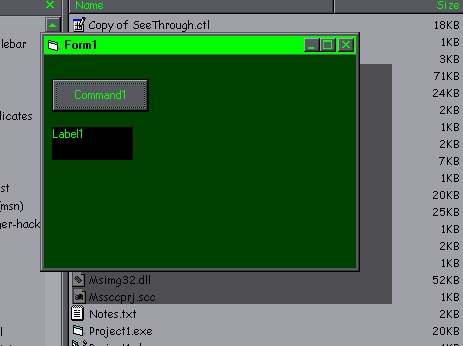



## more 3Dish effects: Form DropShadow

### Description

Updated: this idea was expanded from Brian Kurtyka's Self updaing transparent / translucent form using the alphablend (THX a mil brian, you taught me alphablending just from that one examble...)

in the screenshot you'll see a shadow cast by the form. Draws directly to the screen, uses the RedrawWindow API, and all in a simple to add OCX for those who dont wanna mess with the code.. just add it and run it, and theres your effect.. due to the alphablending dll, this will *now* run in the IDE, just copy the dll's to your system dir.. i use lots of DoEvents to make sure everyhting is done right..*shrug*
 
### More Info
 
Chopy changes :( need someone to make that a bit more fludic..

             |
---                |---
**Submitted On**   |2000-08-12 13:17:06
**By**             |[^DaRk^](https://github.com/Planet-Source-Code/PSCIndex/blob/master/ByAuthor/dark.md)
**Level**          |Intermediate
**User Rating**    |4.0 (12 globes from 3 users)
**Compatibility**  |VB 6\.0
**Category**       |[Graphics](https://github.com/Planet-Source-Code/PSCIndex/blob/master/ByCategory/graphics__1-46.md)
**World**          |[Visual Basic](https://github.com/Planet-Source-Code/PSCIndex/blob/master/ByWorld/visual-basic.md)
**Archive File**   |[CODE\_UPLOAD89588142000\.zip](https://github.com/Planet-Source-Code/dark-more-3dish-effects-form-dropshadow__1-10632/archive/master.zip)

